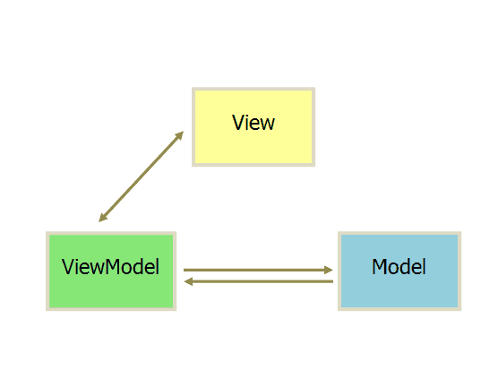

# MVVM

对于一个全栈开发工程师来说，懂前端才会开发出更好的后端程序（不懂前端的后端工程师会设计出非常难用的API），懂后端才会开发出更好的前端程序。（摘自[廖雪峰的官方网站](https://www.liaoxuefeng.com)）

## 什么是MVVM

MVVM最早在微软的一篇博文[《Model/View/ViewModel pattern for building WPF apps》](https://blogs.msdn.microsoft.com/johngossman/2005/10/08/introduction-to-modelviewviewmodel-pattern-for-building-wpf-apps/)被提出。

它是一个视图UI系统设计规约或者说范式，是一种用户视图开发的抽象设计模式。MVVC是MVC的一个演变，它将视图和模型隔离，使得视图设计师可以更专注于视图的设计，业务模块的开发者更专注于后端接口的设计，业务逻辑的实现。

MVVM由三部分组成，M(Model)，V(View)，VM(ViewModel)，Model为承载业务数据的实体，View则为展示给用户的视图，ViewModel作为连接两者的桥梁，将Mode和View绑定在一起。

通过Model和View的分离，我们可以将关注点集中在视图的设计，或者模型的状态变化当中，而这两者的联系由抽象层ViewModel完成。




- M-Model : 实体模型(js对象)

- V-View : 布局文件(HTML)

- VM-ViewModel : binder所在之处，对外暴露出公共属性，View和Model的绑定器


## 一个简单的MVVM的示例

**View**

```
<!-- HTML -->
<p>Hello, <span id="name">Bart</span>!</p>
<p>You are <span id="age">12</span>.</p>
```

**Model**

```
var person = {
    name: 'Bart',
    age: 12
};
```

**操作**

```
person.name = 'Homer';
person.age = 51;
```

在这个示例中，`person`的`name`和`age`发生改变时，页面中的内容也会发生相应的改变；通过改变Model的内容，视图的展示也随之发生变化，ViewModel在其中隐式地进行连接。

# Vue

## Vue 实例

一切都从`new`一个`Vue`实例开始。

```
var vm = new Vue({
  // 选项
})
```

Vue对象是整个Vue工程的根对象，它的作用就是ViewModel，它包含了整个工程的所有内容，包括所有的数据、视图和行为。也就是说整个工程就是一个Vue对象。

## Vue 对象的主要成分

### 生命周期钩子

Vue对象生命周期中的一些钩子方法，包括`beforeCreate`、`created`、`beforeMount`、`mounted`、`beforeUpdated`、`updated`、`beforeDestroy`、`destroyed`等，这些属性均为函数类型。


### `el`属性

Vue对象挂载点，页面当中的某个`DOM`元素，可以是指向该元素的CSS选择器或者是一个`HTMLElement`实例。

### `components`属性

可以在视图中直接引用的组件，具有Vue对象相似的对象结构和功能，通过在Vue对象中添加该属性，可以作为全局组件被调用。

### `data`属性

所有的Model的递归集合，该属性必须是纯粹的对象，也就是只包含属性不包含行为。（注意：在组件当中该属性为返回Model的函数）

### `template`属性

`String`类型的页面模板，将会替换掉挂载点`DOM`元素，作为挂载点处页面的视图。

`data`属性和`template`属性分别对应MVVM中的Model和View，通过作为ViewModel的`Vue`对象联系在一起。

## 组件介绍

将整个页面划分为各种组件，实现关注点分离，页面解耦。

### 组件注册

### `prop`属性

### `model`属性

## router介绍

用于页面路由，由于是单页面应用（SPA），页面路由是通过组件的切换完成的。
