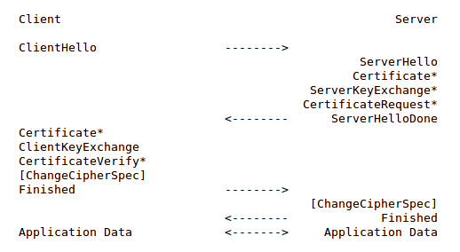
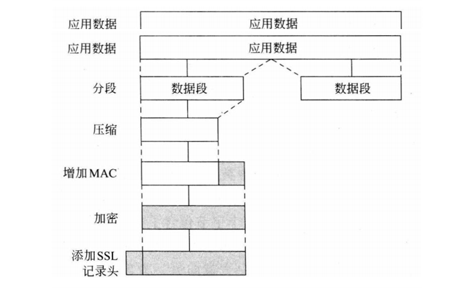

### 一、为什么使用TLS

在SSL/TLS出现之前，很多应用层协议（http、ftp、smtp等）都存在着网络安全问题，例如大家所熟知的http协议，在传输过程中使用的是明文信息，传输报文一旦被截获便会泄露传输内容；传输过程中报文如果被篡改，无法轻易发现；无法保证消息交换的对端身份的可靠性。为了解决此类问题，人们在应用层和传输层之间加入了SSL/TLS协议。

### 二、什么是TLS

TLS（Transport Layer Security，安全传输层)，TLS是建立在传输层TCP协议之上的协议，服务于应用层，它的前身是SSL（Secure Socket Layer，安全套接字层），它实现了将应用层的报文进行加密后再交由TCP进行传输的功能。

#### TLS的作用

TLS协议主要解决如下三个网络安全问题。

1. 保密(message privacy)，保密通过加密encryption实现，所有信息都加密传输，第三方无法嗅探；
2. 完整性(message integrity)，通过MAC校验机制，一旦被篡改，通信双方会立刻发现；
3. 认证(mutual authentication)，双方认证,双方都可以配备证书，防止身份被冒充；

#### TLS的发展过程

- 1995: SSL 2.0, 由Netscape提出，这个版本由于设计缺陷，并不安全，很快被发现有严重漏洞，已经废弃。
- 1996: SSL 3.0. 写成RFC，开始流行。目前(2015年)已经不安全，必须禁用。
- 1999: TLS 1.0. 互联网标准化组织ISOC接替NetScape公司，发布了SSL的升级版TLS 1.0版
- 2006: TLS 1.1. 作为 [RFC 4346](https://tools.ietf.org/html/rfc4346) 发布。主要修复了CBC模式相关的如BEAST攻击等漏洞
- 2008: TLS 1.2. 作为 [RFC 5246](https://tools.ietf.org/html/rfc5246)发布 。增进安全性，目前应该主要部署的版本
- 2015之后: TLS 1.3，还在制订中，支持0-rtt，大幅增进安全性，砍掉了aead之外的加密方式

### TLS是怎样实现的

TLS协议可以分为两部分

1. 记录协议（Record Protocol）
通过使用客户端和服务端协商后的秘钥进行数据加密传输。

2. 握手协议（Handshake Protocol）
客户端和服务端进行协商，确定一组用于数据传输加密的秘钥串。

#### TLS握手过程

- **步骤 1.** ClientHello – 客户端发送所支持的 SSL/TLS 最高协议版本号和所支持的加密算法集合及压缩方法集合等信息给服务器端。

- **步骤 2.** ServerHello – 服务器端收到客户端信息后，选定双方都能够支持的 SSL/TLS 协议版本和加密方法及压缩方法，返回给客户端。

- **（可选）步骤 3.** SendCertificate – 服务器端发送服务端证书给客户端。

- **（可选）步骤 4.** RequestCertificate – 如果选择双向验证，服务器端向客户端请求客户端证书。

- **步骤 5.** ServerHelloDone – 服务器端通知客户端初始协商结束。

- **（可选）步骤 6.** ResponseCertificate – 如果选择双向验证，客户端向服务器端发送客户端证书。

- **步骤 7.** ClientKeyExchange – 客户端使用服务器端的公钥，对客户端公钥和密钥种子进行加密，再发送给服务器端。

- **（可选）步骤 8.** CertificateVerify – 如果选择双向验证，客户端用本地私钥生成数字签名，并发送给服务器端，让其通过收到的客户端公钥进行身份验证。

- **步骤 9.** CreateSecretKey – 通讯双方基于密钥种子等信息生成通讯密钥。

- **步骤 10.** ChangeCipherSpec – 客户端通知服务器端已将通讯方式切换到加密模式。

- **步骤 11.** Finished – 客户端做好加密通讯的准备。

- **步骤 12.** ChangeCipherSpec – 服务器端通知客户端已将通讯方式切换到加密模式。

- **步骤 13.** Finished – 服务器做好加密通讯的准备。

- **步骤 14.** Encrypted/DecryptedData – 双方使用客户端密钥，通过对称加密算法对通讯内容进行加密。

- **步骤 15.** ClosedConnection – 通讯结束后，任何一方发出断开 SSL 连接的消息。

#### TLS记录协议

#### TLS Java编程示例
