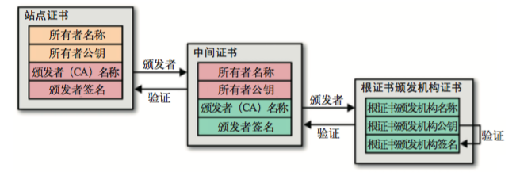

### 数据加密

#### 什么是加密

数据加密就是将数据从明文转变为密文的过程，可以理解为输出为密文的函数`encrypt(data, key)`，data为加密前的明文数据，key为加密用的秘钥。

#### 为什么要加密

加密的主要目的是防止数据在传输过程中被别人窃取。

#### 加密的分类

- **对称加密：** 加密和解密过程使用同一个秘钥的加密方式。常见算法有：DES，AES，3DES等等。

- **非对称加密：** 加密和解密过程使用一对不同的秘钥，通常一个作为公钥对外提供，一个作为私钥不对外提供。常见算法有RSA，ECC。

### 数字签名

#### 消息摘要

消息摘要是指将不固定的数据通过摘要算法转换为固定的数据，这个转换过程的逆运算代价相当高，所以可以认为几乎不可逆。对于一个数据内容，在我们能保证已拥有的数据摘要的真实性的情况下，我们可以通过求数据的摘要来验证数据完整性，这个过程的前提是所有的数据接收方在接收数据之前已经获取了可靠的消息摘要。

#### MAC

消息认证码（message authentication code, MAC）,可以理解为经过对称加密的消息摘要，同样是用于验证数据的完整性，相较于消息摘要，只有秘钥持有者才可以进行数据校验，并且保证了数据的真实性，数据只能是由秘钥持有者产生。

#### 数字签名

数字签名和MAC类似，但是采用的非对称加密，相较于MAC，不仅保证了数据完整性和真实性，还能保证数据不可否认性。对于MAC，秘钥持有者既可以验证数据也可以生成数据，所以无法保证接收到的数据是由谁产生的。相反，数字签名只有私钥持有者可以生成，于是可以保证数据是由私钥持有者产生。

### 数字证书

#### 怎么保证“你就是你”

通过数字签名我们可以保证数据来自于私钥持有者，可是这建立在我们认识他的情况下（我们持有他的公钥），那么我们怎么保证我们持有的公钥就是他的公钥呢。我们通过私钥持有者的名片（数字证书）来完成这个工作。

#### 什么是数字证书

为了保证“你就是你”，我们需要你提供名片（数字证书），为了保证你的名片的真实性，我们需要权威机构在你的名片上盖个章。

数字证书其实就是将私钥持有者的身份信息和公钥放在一起打个包生成名片，然后找一个大家都信得过的机构（Certificate Authority, CA）给这个名片生成一个数字签名。通常操作系统都会保存一些可信任的证书颁发机构的证书，通过使用根证书可以验证其他证书信息的真实性。

#### 数字证书的验证过程

上图是数字证书的验证链，当收到一个新的数字证书时，为了验证数字证书的可靠性，需要验证证书内容的数字签名，首先要取出证书中记录的颁发者机构的名称，根据颁发者的名称我们获取到颁发者的数字证书，当颁发者不在可信任的证书颁发机构的列表中时，会重复这个操作，直到发现可信任的证书颁发机构或者可信任的根证书（证书验证链的末端，一系列大家公认的证书），然后自底向上验证证书的可靠性。
